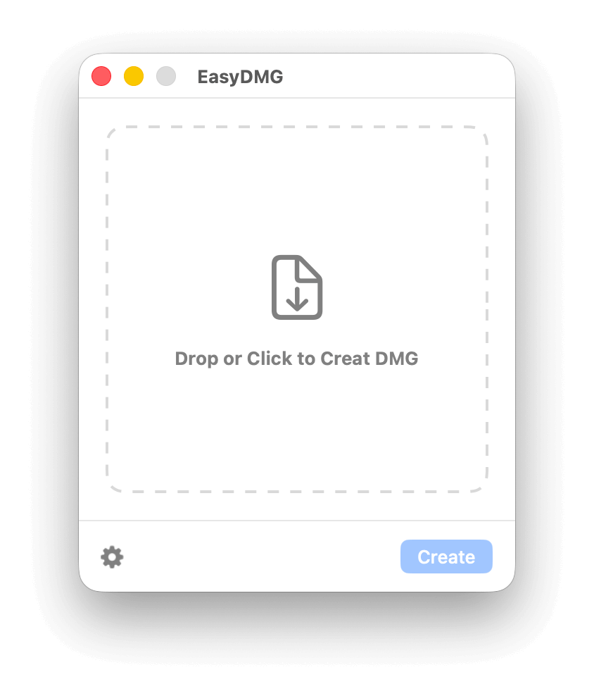
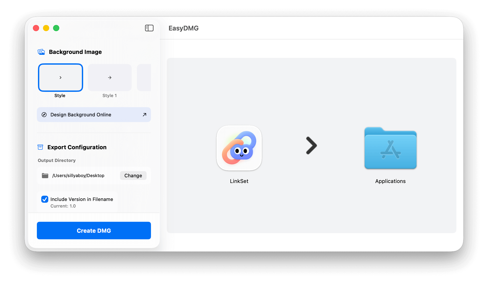

# EasyDMG

一个简洁优雅的 macOS 原生应用程序，用于快速创建专业的 DMG 安装包。

  

## 📸 应用截图

### 简洁模式
<div align="center">

</div>

*简洁直观的拖拽界面，一键创建 DMG*

### 高级模式
<div align="center">

</div>

*功能丰富的高级设置界面，支持实时预览和精确调整*

## ✨ 特性

### 👍🏻 简单易用
- **拖拽操作**: 直接拖拽 .app 文件到界面即可开始
- **一键创建**: 点击按钮即可生成专业的 DMG 安装包
- **双模式界面**: 简洁模式和高级模式，满足不同需求

### 🎨 视觉定制
- **多种背景**: 内置 3 种精美背景模板
- **自定义背景**: 支持上传自定义背景图片（最多 3 张）
- **实时预览**: 所见即所得的 DMG 布局预览
- **拖拽调整**: 直接在预览中拖拽调整图标位置

### ⚙️ 高级配置
- **布局控制**: 精确控制窗口大小和图标位置
- **文件命名**: 可选择是否在文件名中包含版本号
- **输出目录**: 自定义 DMG 文件保存位置
- **坐标显示**: 实时显示图标坐标，便于精确调整

### 🔧 技术特性
- **AppleScript 集成**: 自动设置 Finder 窗口样式
- **hdiutil 封装**: 使用系统工具确保兼容性
- **进度显示**: 实时显示 DMG 创建进度
- **错误处理**: 完善的错误提示和处理机制
- **遥测分析**: 集成 TelemetryDeck 进行使用情况分析和性能优化

## 📊 隐私与数据

EasyDMG 集成了 TelemetryDeck 遥测服务来收集匿名使用数据，帮助我们改进应用：

- **完全匿名**: 不收集任何个人身份信息
- **用途透明**: 仅用于了解功能使用情况和修复错误
- **用户控制**: 遵循系统隐私设置，用户可随时禁用
- **数据安全**: 所有数据传输均经过加密

详细信息请查看 [遥测集成文档](TELEMETRY_INTEGRATION.md)。

## 📋 系统要求

- macOS 14.0 或更高版本

## 🚀 快速开始

### 安装

1. 克隆仓库：
```bash
git clone https://github.com/sillyaboy/EasyDMG.git
cd EasyDMG
```

2. 使用 Xcode 打开项目：
```bash
open EasyDMG.xcodeproj
```

3. 构建并运行项目

### 使用方法

#### 简洁模式

1. 启动 EasyDMG
2. 拖拽 .app 文件到界面，或点击选择文件
3. 点击 "Create" 按钮创建 DMG

#### 高级模式

1. 点击齿轮图标进入高级设置
2. 在左侧面板配置各种选项：
   - 选择背景图片
   - 设置输出目录
   - 配置文件命名规则
3. 在右侧预览面板拖拽调整图标位置
4. 点击 "Create DMG" 完成创建

## 🎨 背景图片

### 自定义背景
- 支持 PNG、JPEG、TIFF 格式
- 推荐尺寸：660×400 像素
- 自动压缩和优化存储
- 最多保存 3 张自定义背景


## 🐛 故障排除

### 常见问题

**Q: DMG 创建失败，提示 hdiutil 错误**
A: 确保有足够的磁盘空间，并检查输出目录的写入权限

**Q: AppleScript 执行失败**
A: 在系统偏好设置中授予 EasyDMG 辅助功能权限

**Q: 背景图片不显示**
A: 检查图片格式是否支持，推荐使用 PNG 或 TIFF 格式

**Q: 图标位置不准确**
A: 使用预览模式拖拽调整，或在设置中查看精确坐标

### 调试模式
在 Debug 模式下，临时文件不会被自动清理，可以在以下位置查看：
```
/tmp/EasyDMG_Build_[UUID]/
```


### ☕️ 支持开发

如果这个项目对你有帮助，请给它一个 ⭐️！也可以请我喝杯咖啡支持开发：

<div align="center">
<a href="https://ko-fi.com/huatingliu">

<br>
<strong>在 Ko-fi 上支持我</strong>
</a>
</div>

你的支持是我持续改进和维护这个项目的动力！

---

**EasyDMG** - 让 DMG 创建变得简单优雅  ✨
